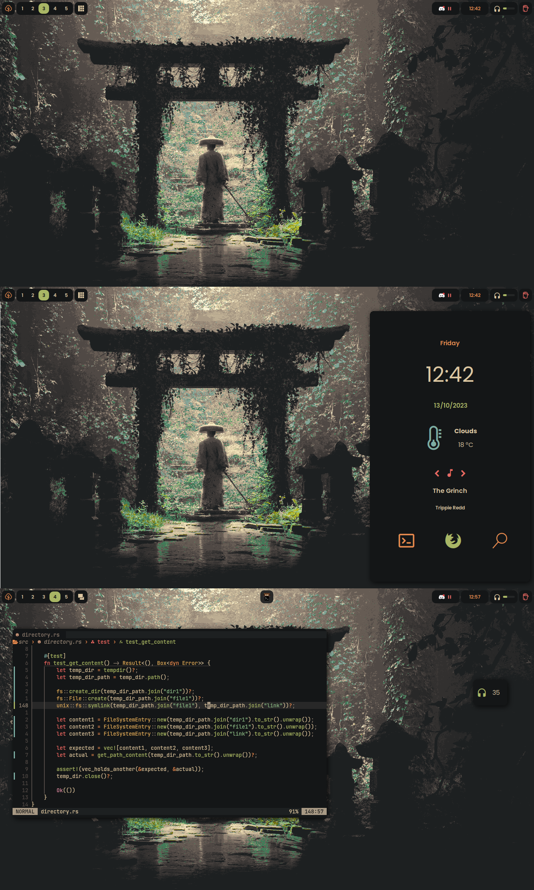
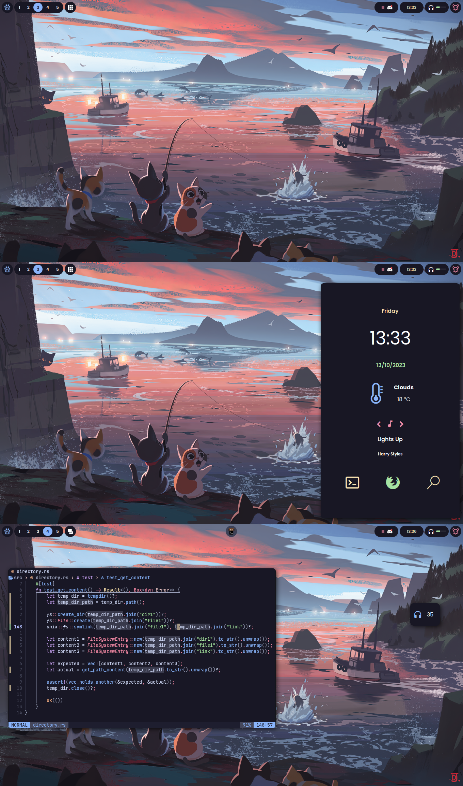

# Intro

Hello there. I'm not sure how you ended up here,
but be welcome. This is the repository where I keep my dotfiles. At this
point i feel very productive and very happy with my enviroment. It's really
worth to spend a good amout of time on this stuff.

> Since I started using [tmux](https://github.com/tmux/tmux) I feel the unlimited power ⚡.

# dotfiles?

Yes, my little green friend. If you are not used to Unix stuff, this might seen weird. I'll explain real quick:
Us, Unix-based OS's enjoyers, really like customizing and adapating our work enviroments to our needs.
This envolves the looking and functionality of multiple softwares. Dotfiles are just
the files thoose softwares use to their configuration.

> It is called dotfiles because they are, usually, hidden files e.g .zshrc

# Installation

I wrote some scripts to help me install the configuration on strange or new enviroments.
The script will ask if it should install with symlinks or just copy all the stuff. They also
create a backup for the old configuration, so don't be worry.

First clone this repo on your machine:

```bash
git clone https://github.com/marcos-brito/dottiles
```

Then run this inside the dotfiles directory:

```bash
chmod +x ./install.sh;
./install.sh
```

or

```bash
chmod +x ./install.py;
./install.py
```

## Neovim on Windows

Sometimes (really sad times btw) the need for using a machine running Windows nocks at my door. I
wrote a script to easily install Neovim on Windows.

> It needs python 😪. Run the lastest and you should be fine.

```bash
python ./install_nvim_on_windows.py
```

If it goes wrong try closing and opening Powershell and then run it again. The script installs scoop and for some reason
Poweshell doesn't "see" that scoop is installed immediately, thus it can install Neovim using it.

# Screenshots

Here are some screnshots of my enviroment. I made three different colorschemes.

## Gruvbox



## Catppuccin



## Everforest

I don't like this one.
